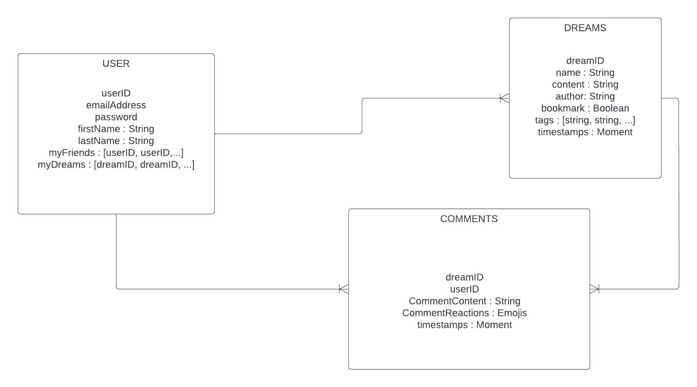

# DreamCatcher

## What is DreamCatcher?

DreamCatcher is like social media but exclusively for sharing dreams. Our webapp is designed so that user can share and keep track of their dreams. Dreamers can also add other dreamers to their circle of friends, follow and comment their dreams. Each dream can have tags and Dreamers can explore and see the most used hashtags. 

## Requirements

Build a web application from scratch.
Use Express framework to build your application
Deploy on Heroku so application is live on the web

User resource
User must have a profile
User must be able to edit their profile
User must be able to change password

Authentication
User must be able to sign up
User must be able to sign in
User must be able to sign out

2 extra resources of your choice (other than User)
User must be able to create a resource
User must be able to edit a resource
User must be able to view all resources they created
User must be able to view a single resource they created
User must not be able to edit or delete other users' resources

## Process

On our first meeting we spent some time deciding what we were going to create for our first full-stack project. After lots of discussion we decided that a public dream journal would be a fun idea, so we got to dividing tasks. As I started on the wireframes and a boilerplate project my partner got started on the ERD and designing the logo. Tasks for the functionality and styling of the app were then put on a Trello board so that we could tick them off as we went along. Every morning and after lunch we would meet on zoom to discuss progress and talk through difficulty. We then deployed our project on day four then presented it the next day. 

While styling and front-end development were shared evenly for this project, for the back-end I was responsible for creating the models, controllers, and views for both dreams and comments. Following the ERD’s closely I got started by setting up the models with all the appropriate fields, then linking these up with views and controller files which were created subsequently. Since the process for dreams and comments were very similar, one I had everything written for the dream functionality, the comments came much more quickly. 

## Challenges

Our biggest challenge was accepting that we had embarked on an incredibly ambitious project while still learning the ropes of express and node.js, which meant that towards the end of the week we had to decide what exactly we would include and what we would not. In the end we had to shelf bookmarks, friends, reactions, and the explore page. Ultimately it was never realistic for two people to incorporate all those elements into the site in just four days however we did manage to get a good amount done under the circumstances. It took me three days to write the code for the back end of the project, with one day left for styling and deployment. 

## Team Members

https://www.linkedin.com/in/alexandragp
https://www.linkedin.com/in/sam-hackwood-40b050233/

## Unresolved Problems

At the time of first deploying the project, we had issues with editing comments, displaying user information on comments, and some faulty CSS. I continued to work on the project and managed to get them solved. I also linked the tabs to unfinished features to a more sightly ‘in development’ page, rather than a “CANNOT GET ‘/’” alert. However, there are still some issues with authorisation which remain unsolved. 

## Future Enhancements 

Bookmark
Friends
Reactions (emojis)
Hashtags / Explore page

## ERD

## Wireframes

[DreamCatcher's Wirefames](https://xd.adobe.com/view/633e8cf1-5db8-4199-84dc-fec3f6a179d6-366d/)

## Task Management

[Trello](https://trello.com/invite/b/sPft6RuF/93f3f5bb3044a1c61b76a5264903d0bf/dreamshare)

## Deployed App
[DreamCatcher](https://dreamcatchersei64.herokuapp.com/)

